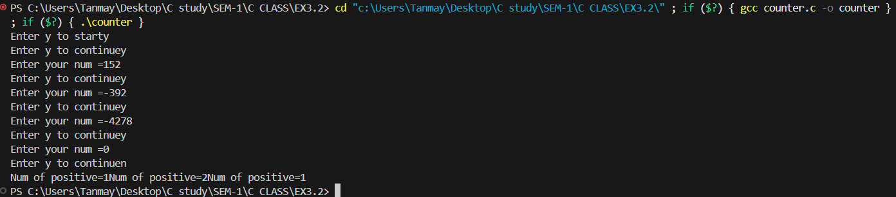
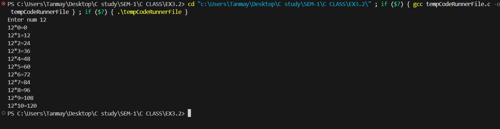
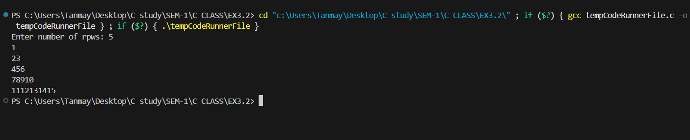
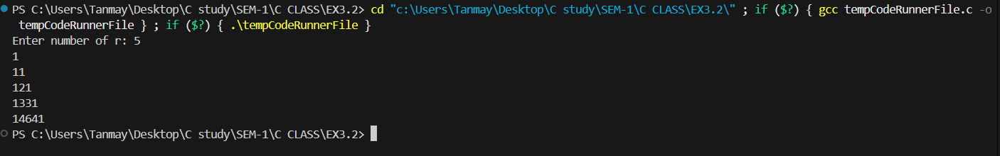

Experiment 3.2: Loops  
 

1.  WAP to enter numbers till the user wants. At the end, it should display the  
    count of positive, negative, and Zeroes entered.  
     

Program:

#include&lt;stdio.h&gt;

void main(){

int a,p=0,n=0,o=0,c=0;

char choice;

&nbsp;

do{

printf("Enter y to continue");

scanf(" %c",&choice);

while(choice=='y'||choice=='Y'){

&nbsp;

printf("Enter your num =");

scanf("%d",&a);

&nbsp;

if(a==0){

o++;

}

else if(a>0){

p++;

}

else if(a<0){

n++;

}

break;

&nbsp;

}

} while(choice=='y');

printf("Num of positive=%d",p);

printf("Num of positive=%d",n);

printf("Num of positive=%d",o);

}

&nbsp;

2\. WAP to print the multiplication table of the number entered by the user. It  
should be in the correct formatting. Num \* 1 = Num  
 Program:

#include &lt;stdio.h&gt;

void main(){

int a,b;

printf("Enter num ");

scanf("%d",&a);

b=0;

while(b<=10){

printf("%d\*%d=%d\\n",a,b,a\*b);

b++;

}

}

&nbsp;

&nbsp;

3\. WAP to generate the following set of output.  
a.  
1  
2 3  
4 5 6

Program:

#include &lt;stdio.h&gt;

int main() {

int r, i, j, n = 1;

printf("Enter number of rpws: ");

scanf("%d", &r);

for (i = 1; i <= r; i++) {

for (j = 1; j <= i; j++) {

printf("%d", n++);

}

printf("\\n");

}

return 0;

}

b.  
1  
1 1  
1 2 1  
1 3 3 1  
1 4 6 4 1

&nbsp;

Program:

#include &lt;stdio.h&gt;

int main() {

int r, i, j;

int n;

printf("Enter number of r: ");

scanf("%d", &r);

for (i = 0; i < r; i++) {

n = 1;

for (j = 0; j <= i; j++) {

printf("%d", n);

n = n \* (i - j) / (j + 1);

}

printf("\\n");

}

return 0;

}

4\. The population of a town is 100000. The population has increased steadily at  
the rate of 10% per year for the last 10 years. Write a program to determine  
the population at the end of each year in the last decade.

&nbsp;

&nbsp;

&nbsp;

# #include &lt;stdio.h&gt;

&nbsp;

int main() {

double pop = 100000;

double rate = 0.10;

int year;

printf("Year\\tPopulation\\n");

for (year = 1; year <= 10; year++) {

pop = pop + (pop \* rate);

printf("%d\\t%.0lf\\n", year, pop);

}

return 0;

}